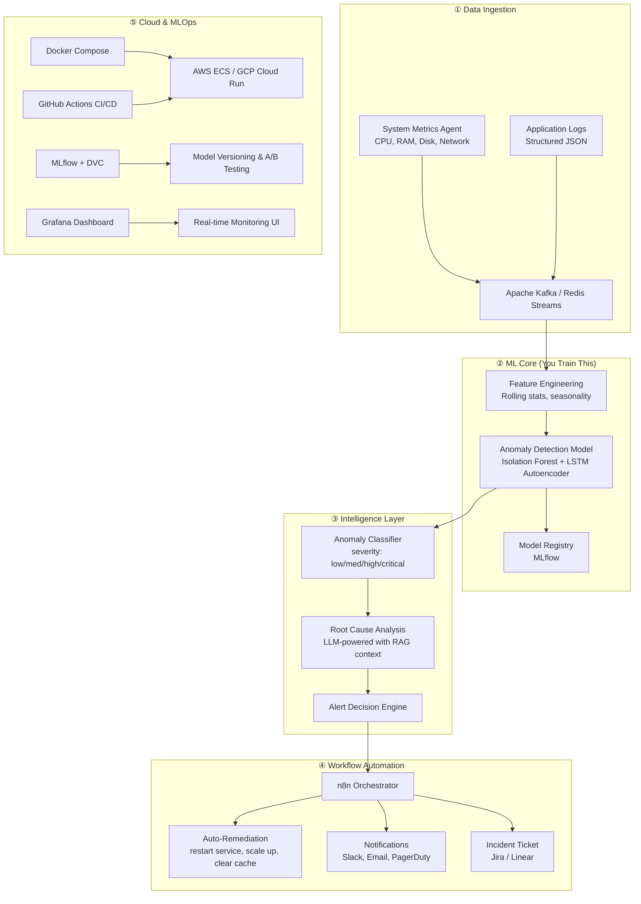

# 🚀 Project Pitch: **SentinelAI — Intelligent Infrastructure Monitoring Platform**

## Why This Project?

I analyzed your [GitHub portfolio](https://github.com/NEXwiz?tab=repositories) and here's what I see:

### What You Already Have (Strong)
| Project | What It Shows |
|---|---|
| **ConnectPlus** | Semantic search, pgvector, FastAPI, React |
| **Artha** | AI agents, MCP servers, Gemini, Mem0 memory |
| **DocIntel** | RAG pipeline, document chunking, Q&A |
| **Autonomous Research Agent** | LangGraph, multi-agent, parallel execution |
| **MERN-ThinkBoard** | Full-stack CRUD |
| **Cricket-Data-Analysis** | Data analytics |
| **Garbage Classifier** | Image classification (Jupyter) |

### What's Missing (The Gap)
Your portfolio is heavy on **LLM wrappers / AI agents** but lacks:

> [!IMPORTANT]
> - ❌ **Custom ML model training** — you call APIs (Gemini, etc.) but don't train your own models
> - ❌ **MLOps / ML pipeline** — no model versioning, experiment tracking, CI/CD for ML
> - ❌ **Workflow automation** — no n8n, Airflow, or event-driven pipelines
> - ❌ **Cloud-native deployment** — no Docker, Kubernetes, or cloud services (AWS/GCP)
> - ❌ **Real-time / streaming data** — everything is batch or request-response
> - ❌ **Production monitoring** — no observability, alerting, or feedback loops

**SentinelAI fills ALL of these gaps in one cohesive project.**

---

## The Project: SentinelAI

> **An end-to-end ML-powered infrastructure monitoring platform that ingests real-time system metrics & logs, detects anomalies using a custom-trained model, auto-remediates issues via n8n workflows, and deploys on the cloud with full MLOps.**

Think of it as **Datadog meets PagerDuty, but you build the ML brain yourself.**

---

## Architecture Overview



---

## Core Technical Components

### 1. 🧠 Custom ML Model (The Strongest Part)

This is **NOT an API wrapper** — you train your own models:

```
├── models/
│   ├── isolation_forest/        # Unsupervised anomaly detection
│   │   ├── train.py             # Scikit-learn pipeline
│   │   ├── feature_engineering.py
│   │   └── evaluate.py
│   ├── lstm_autoencoder/        # Deep learning for time-series
│   │   ├── model.py             # PyTorch/TensorFlow
│   │   ├── train.py
│   │   └── inference.py
│   └── ensemble/                # Combine both for robustness
│       └── voting_classifier.py
```

**What you'll learn & demonstrate:**
- Feature engineering on time-series data (rolling means, z-scores, seasonality decomposition)
- Unsupervised learning (Isolation Forest, DBSCAN)
- Deep learning (LSTM Autoencoder for sequence anomaly detection)
- Ensemble methods for production robustness
- Hyperparameter tuning with Optuna

> [!TIP]
> **Dataset:** Use the [NAB (Numenta Anomaly Benchmark)](https://github.com/numenta/NAB) dataset to start, then generate synthetic metrics from your own systems for a real demo.

---

### 2. ⚡ n8n Workflow Automation

This is where it gets production-ready:

| Workflow | Trigger | Actions |
|---|---|---|
| **Critical Alert** | Anomaly score > 0.95 | Slack alert → Create Jira ticket → Page on-call |
| **Auto-Remediate** | Known pattern (e.g., memory leak) | Restart container → Verify health → Log outcome |
| **Model Retrain** | Weekly cron / drift detected | Pull new data → Retrain → Evaluate → Deploy if better |
| **Daily Report** | 9 AM cron | Aggregate anomalies → Generate summary → Email stakeholders |
| **Feedback Loop** | User marks false positive | Update labels → Queue for next retrain cycle |

**n8n connects via webhooks to your FastAPI backend.** Each workflow is version-controlled as JSON.

---

### 3. ☁️ Cloud-Native Architecture

```
├── infrastructure/
│   ├── docker/
│   │   ├── Dockerfile.api          # FastAPI inference server
│   │   ├── Dockerfile.worker       # Kafka consumer + ML pipeline
│   │   ├── Dockerfile.n8n          # n8n with custom nodes
│   │   └── docker-compose.yml      # Full local stack
│   ├── terraform/                   # Infrastructure as Code
│   │   ├── main.tf
│   │   ├── ecs.tf                  # or cloud_run.tf
│   │   └── variables.tf
│   └── github-actions/
│       ├── ci.yml                  # Lint, test, build
│       ├── cd.yml                  # Deploy to cloud
│       └── ml-pipeline.yml         # Retrain + evaluate + promote
```

---

### 4. 🖥️ Full-Stack Dashboard (React + WebSocket)

Real-time monitoring UI showing:
- Live metric streams (CPU, memory, disk) with **D3.js / Recharts**
- Anomaly overlay on time-series graphs
- Alert history with root cause explanations (LLM-generated)
- Model performance dashboard (precision, recall, drift metrics)
- n8n workflow execution logs

---

## Tech Stack

| Layer | Technology | Why |
|---|---|---|
| **ML Training** | Scikit-learn, PyTorch, Optuna | Real ML, not just API calls |
| **ML Ops** | MLflow, DVC, ONNX | Experiment tracking, model versioning |
| **Data Pipeline** | Apache Kafka / Redis Streams | Real-time streaming |
| **Backend** | FastAPI (Python) | You already know it from ConnectPlus |
| **Automation** | n8n (self-hosted) | Visual workflow builder, webhook-driven |
| **Frontend** | React + TypeScript | You already know React |
| **Database** | TimescaleDB (PostgreSQL ext.) | Time-series optimized |
| **Monitoring** | Prometheus + Grafana | Industry-standard observability |
| **Cloud** | AWS (ECS + S3 + CloudWatch) or GCP | Production deployment |
| **CI/CD** | GitHub Actions | Already on GitHub |
| **Containerization** | Docker + Docker Compose | Production-ready packaging |

---

## Scalability Roadmap (Future Features)

This is designed to grow:

### Phase 1 (MVP — 3-4 weeks)
- [x] Metric ingestion pipeline (Redis Streams)
- [x] Isolation Forest anomaly detection on system metrics
- [x] FastAPI inference endpoint
- [x] Basic React dashboard with charts
- [x] Docker Compose for local deployment
- [x] n8n webhook alert workflow (Slack notification)

### Phase 2 (Production — 2-3 weeks)
- [ ] LSTM Autoencoder for time-series anomaly detection
- [ ] MLflow experiment tracking & model registry
- [ ] Auto-remediation workflows in n8n
- [ ] Cloud deployment (Terraform + GitHub Actions)
- [ ] Grafana dashboards

### Phase 3 (Advanced — ongoing)
- [ ] Multi-tenant support (monitor multiple services)
- [ ] LLM-powered root cause analysis (RAG over runbooks)
- [ ] Predictive alerting (forecast failures before they happen)
- [ ] Custom n8n nodes for your specific use case
- [ ] A/B testing between model versions
- [ ] Federated monitoring across regions

---

## Why This Stands Out on Your Resume

| Hiring Manager Sees | What It Proves |
|---|---|
| Custom-trained ML models | You understand ML fundamentals, not just API calls |
| Real-time data pipeline | You can handle streaming/production workloads |
| n8n workflow automation | You think about operational excellence |
| Docker + Cloud deployment | You ship to production, not just Jupyter notebooks |
| MLflow + DVC | You understand MLOps lifecycle |
| CI/CD with GitHub Actions | You follow engineering best practices |
| Monitoring + alerting | You build systems that run reliably |

> [!CAUTION]
> **What separates this from your existing projects:** ConnectPlus and Artha are great, but they're essentially **"LLM + API + UI"**. SentinelAI shows you can **train models from scratch, deploy them in production, and automate the entire lifecycle** — that's what senior ML engineers do.

---

## Ready to Build?

If you like this pitch, I can start building the project right now — beginning with the project structure, ML training pipeline, and Docker setup. Just say the word! 🔥
